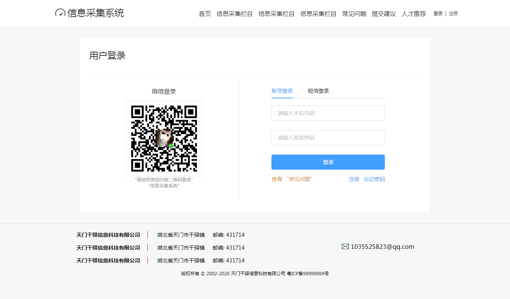
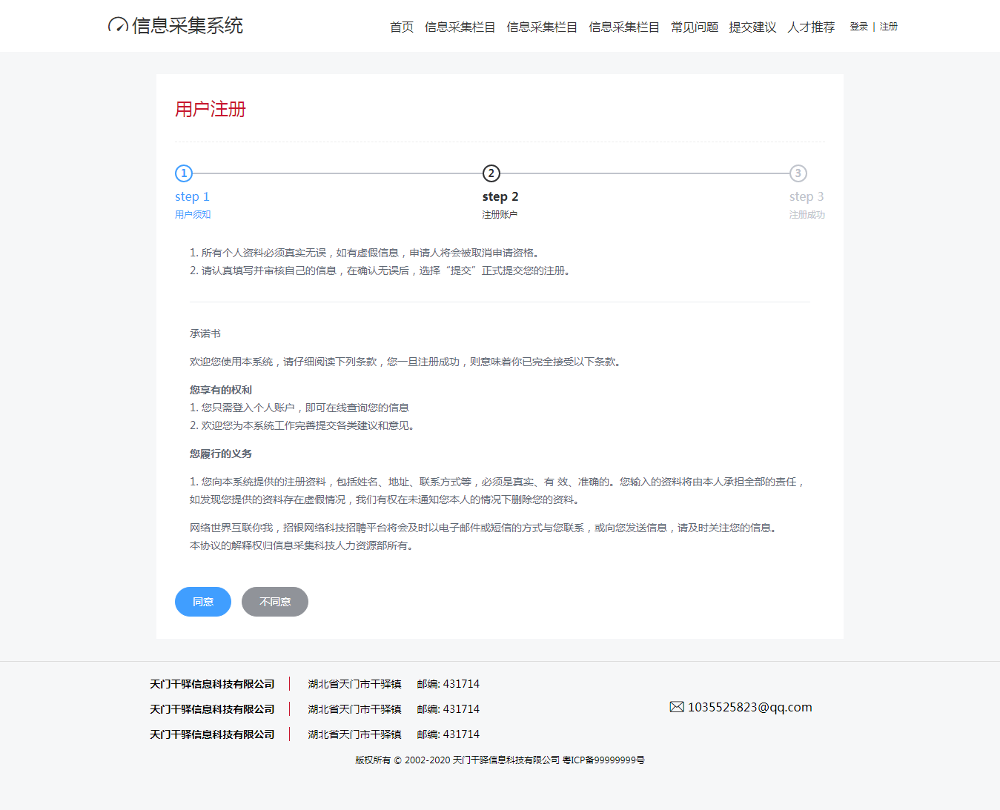
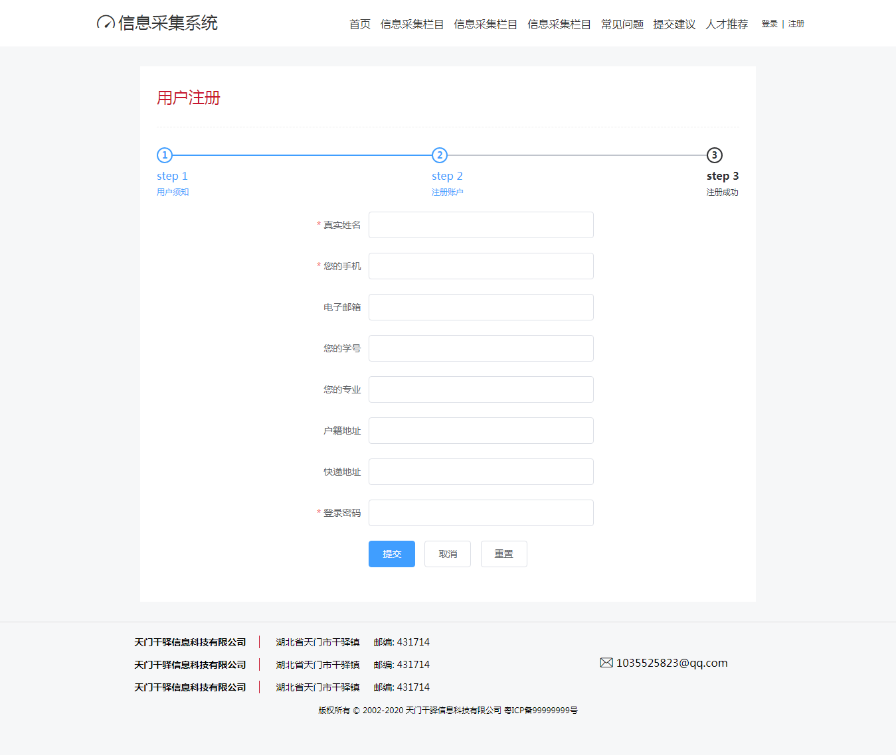

# management-system
### 信息登记系统
# To start
```
# install dependencies
npm install

# koa-server run at http://127.0.0.1:3000
npm run koa_server

# build for production with minification
npm run start

# entry the app and see
http://127.0.0.1:3000/#/pages/login.html
```
### 技术栈
* Font-End JS+HTML+CSS+Vue+Vuex+Vue-Router
* Back-End Koa+MongoDB+NodeJS
### 实现功能
#### 注册功能
* 注册须知功能
* 注册登记功能
* 注册提交功能
#### mongodb 数据库功能
* 目前只支持 数据库插入和查询功能 (忙着赶毕业大论文没时间做)
### 整体页面如下
* 入口 ```http://127.0.0.1:3000/#/pages/login.html```

* 点击注册进入注册页面的第一阶段

* 点击同意 登记信息并提交到数据库
